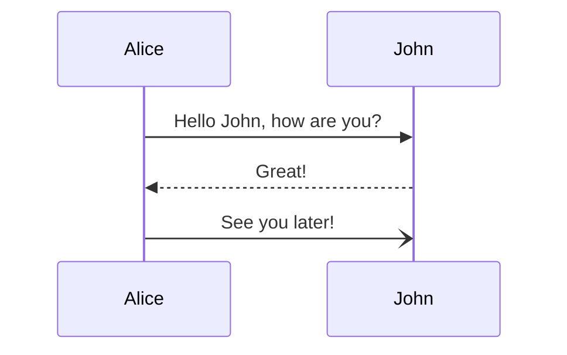

## 功能测试

### LaTeX

$$\int_{0}^{1}\!x^{-x} \mathrm{d}x = \sum_{n=1}^{\infty}n^{-n}$$

$2.7182818284590452353602874713526624977572470936999595749669676277240766303535475945713821785251664274$

### 代码块

```ocaml
(* take first n elements from list xs *)
let take n xs =
  let rec take_impl acc n xs = match (n, xs) with
    | (0, _) -> acc
    | (_, []) -> acc
    | (n, x::xs) -> take_impl (x::acc) (n-1) xs
  in List.rev (take_impl [] n xs)

(* drop first n elements from list xs *)
let rec drop n xs = match (n, xs) with
  | (_, []) -> []
  | (0, xs) -> xs
  | (n, _::xs) -> drop (n-1) xs
```

```plain
Lorem ipsum dolor sit amet, consectetur adipiscing elit, sed do eiusmod tempor incididunt ut labore et dolore magna aliqua. Ut enim ad minim veniam, quis nostrud exercitation ullamco laboris nisi ut aliquip ex ea commodo consequat.
```

### Mermaid 图



### 折叠


Hidden text

