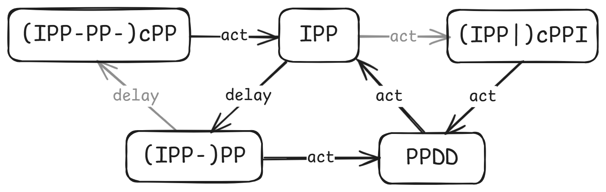

## 自然出怪的特点

在之前我们写的脚本中，绝大多数都假设每一波的刷新时长是一个**定值**。这使得脚本执行的操作与场上状态基本无关，大幅简化了脚本的编写。

但是，当我们把目光转向自然出怪长生存时，我们会面临很多新的问题：

- 两炮激活可能会**刷新延迟**
- 双边热过渡可能会**意外刷新**
- 红眼关随时可能**转白**
- **收尾**的不确定性很大

即便是对于打法非常固定的键控炮阵，这些问题通常也是难以避免的。我们接下来逐个分析这些问题。

刷新延迟和意外刷新在实现上是可以统一的：它们通常的处理方法都是**在某个时间点检查是否刷新**，视结果执行不同的分支。

在转白之后，我们通常希望**改用白眼/快速关的打法**以节省资源。转换阵解时可能需要几个**过渡波**处理残留的红眼。

收尾很难有统一的应对方案，需要视所守列数和炮恢复情况而定。

状态机对前三个问题提供了一种较为泛用的解决方案。它保留了常规逐波/循环定态脚本的易写易读的优点，但同时又有一定的表达能力，足以应对自然出怪冲关的复杂条件。

## 状态机

在状态机的框架下，阵解由许多个**状态**组成，状态之间相互连接。每个状态代表一波或其一部分。

状态之间以**刷新节点**为边界。什么是刷新节点呢？比如你炸了一对激活炮，这时可能激活，也可能没有激活，炮落地的瞬间就是一个刷新节点。

如果阵型里有前场自然输出，有可能你不需要做什么也会自动刷新。这种情况下，**刷新节点是连续的**。状态转移允许指定一个时间区间，在区间内任意时间激活视作正常激活，区间结束时仍未激活视作延迟。

在刷新节点观测到的场上信息会用来决定**转移路径**。如果把阵解建模成一张图，那么状态是节点，转移路径就是连接两者的有向边。比如说你执行一组操作（它们被封装在一个状态中），执行之后可能延迟，也可能激活刷新，就需要为它配置两条转移路径。如果你确信某操作不会出现刷新意外，就可以只配置一条转移路径。

每个转移路径都有**触发条件**。现实中，在根据刷新情况进行状态转移时，我们一般只会使用**固定的几种条件**。作者实现的转移函数支持以下几种条件：

- 延迟
- 激活，下波为指定波次（如w9/w19）
- 激活，下波转白
- 激活，无特殊情况

状态机的优势在于，如果脚本只使用这几种转移条件，则**完全不需要自行编写判断刷新的代码**，具体的判断逻辑交由预定义的转移函数处理。

本文接下来以一个经典超多炮阵型——双冰16炮为例，介绍状态机框架下代码的编写。

## 代码架构

状态机的核心是以下几个变量和函数：

```cpp
unordered_map<string, ATimeline> states;
string lastState, currentState;

_TransitionKey activate, delay, nogiga, finish;
_TransitionKey WaveIs(std::convertible_to<int> auto... waves);

ATimeline Transition(pair<int, int> wl, auto... args);
ATimeline Transition(int wl, auto... args);
void StartTransition(int wave, const string& state);
```

`Transition`函数封装了状态转移的所有逻辑，其调用格式形如`Transition(601, key1 = "next_state_name1", key2 = "next_state_name2", ...)` （如果你对这种语法感到不解：在C++中，operator=可以被重载，并且返回类型可以任意指定）。其中的key可以是`delay`、`activate`、`nogiga`和`finish`，对应上一节中提到的四种转移条件（`finish`等效于`WaveIs(9, 19)`）。

`lastState`和`currentState`是由`Transition`函数自动设置的，在运阵过程中可以读取。

`states`用于存储阵解，键代表状态名（可以任意取），值代表该状态对应的操作。在`AScript()`中，操作被逐个添加到`states`中，形如：

```cpp
states["s1"] = {
    Transition(601, activate = "s2", delay = "s3"),
    At(300) PP(),
};
```

这段代码表示若当前状态为`s1`，则在本波300时刻发一对炮，若401时刻激活，则在下波执行状态`s2`；若401时刻未激活，则在本波执行状态`s3`。

状态机一般需要在w1和w10各启动一次（w20不需要纳入状态机中）。启动状态机的代码是：

```cpp
StartTransition(1, "state1");
StartTransition(10, "state2");
```

一个完整的状态机脚本的大致结构是：

```cpp
// 状态机本身的代码

void AScript() {
    // 选卡等等操作

    states["s1"] = {
        Transition(601, activate = "s2", delay = "s3", finish = "final1"),
        // ...
    };
    states["s2"] = {
        Transition(1200, activate = "s1", delay = "s4", finish = "final2"),
        // ...
    };
    // ...

    StartTransition(1, "s1");
    StartTransition(10, "s1");
    OnWave(20) {
        // ...
    };
}
```

## 阵解分析

### 主循环

本教程侧重于键控脚本编写，对阵解设计部分只是简略带过。如果对本节理解有困难可以跳过。

我们采用经典的ch6解：`IPP-PP|PPDD`循环。运阵过程中有两处可能发生刷新意外：

- `IPP`刷新
- `IPP-PP`延迟

对于前一种情况，我们可以把冰波改成`IPP|cPP`。第二波的`PP`要同时全伤两波的红眼，设冰波1冰1048激活，加速波389激活（垫舞王激活的最晚时机），得出`IPP`波波长应为1048-389=659，对应459热过渡。加速波的红眼再冰一下，避免砸炮。

对于后一种情况，我们可以在激活炮之后再补一对炮，然后直接接下一个冰波。在执行`IPP-PP|PPDD`时，加速波的`PP`发射时本波僵尸还未刷出。本着能不读刷新倒计时就不读的态度，不妨让这对炮无论冰波是否延迟都照常发射。这样的话，冰波延迟时的激活时机为1248+291=1539。（注：由于引信延迟，实际激活时机也可能是1542。引信延迟并不会给此阵造成任何实质上的困难，但会给脚本编写增加无谓的工作量，因此脚本中关闭了引信延迟）

把状态转移关系画成图，是这样的：



代码如下：

```cpp
// 冰波：IPP-PP 1248
states["hb_IPP"] = {
    Transition(659, delay = "hb_(IPP-)PP", activate = "hb_(IPP|)cPPI"),
    At(1) I(),
    At(459) P(15, 8.325),
    At(1048) PP(8.75), // 1048 = 659 + 389
};
states["hb_(IPP-)PP"] = {
    Transition(1248, activate = "hb_PPDD", delay = "hb_(IPP-PP-)cPP"),
};
// 加速波：PPDD 601
states["hb_PPDD"] = {
    Transition(601, activate = "hb_IPP"),
    At(291) PP() & DD<107>(9),
};
// 冰波延迟：IPP-PP-cPP 1739
states["hb_(IPP-PP-)cPP"] = {
    Transition(1739, activate = "hb_IPP"),
    At(1300) C.TriggerBy(AGIGA_GARGANTUAR & CURR_WAVE)(266),
    At(1539) PP(), // 1539 = 1248 + 291
};
// 冰波意外刷新：IPP|cPPI 659|601
states["hb_(IPP|)cPPI"] = {
    Transition(601, activate = "hb_PPDD"),
    At(195) C.TriggerBy(ADANCING_ZOMBIE, ALADDER_ZOMBIE)(40),
    At(390) I(),
};
```

细心的读者可能会问：`hb_(IPP|)cPPI`一定不会延迟吗？事实上热过渡意外刷新和PP延迟对出怪的要求是一定程度上相互冲突的，前一波意外刷新而后一波延迟的概率极低，可以忽略。当然把这一部分补上也是不难的，具体实现就留给读者了。

### 首代

为了省冰，我们在w1和w10用NDD首代一波。虽然红眼关w10 PPDD不太可能延迟，但保险起见写上好了。脚本很简单，就不细讲了：

```cpp
// 红眼关起手：NDD 601
states["hb_NDD"] = {
    Transition(601, activate = "hb_PPDD", delay = "hb_(NDD-)PP"),
    At(292) N({{3, 9}, {4, 9}}) & DD<106>(9),
};
// NDD延迟：NDD-PP 1092
states["hb_(NDD-)PP"] = {
    Transition(1092, activate = "hb_IPP"),
    At(892) PP(), // 892 = 601 + 291
};
```

### 收尾

到目前为止，我们顺利解决了w1~w8，下一个任务是w9/w19。需要注意的是，w9/w19的激活判定**只考虑本波僵尸**，因此可能出现w9激活后w8红眼仍在场上的情况。

收尾的处理方式需要视阵型特点而定。此阵炮数充足，收尾容错很大。ch6冰循环压力本就不大，加之此阵转白后无需用冰，**不需要拖w9/w19的收尾**。因此这里采用了一种比较朴素的处理方式。

首先是w9本波的激活操作。既然已经到了收尾波，没有热过渡的必要，可以直接把`IPP`改成`PPI`（由于主循环时长3700>3475，这里是能复用上的）。加速波反正早晚得冰，不如也改成`PPI`。唯一的例外是上波为`IPP`，此时本波仍需`cPPI`以保证全伤上波红眼。

极端条件下，可能会出现w9 401激活（对应波长1346），而场上仍有w8三血红的情况。这时虽然剩余的炮不够把它们炸死，但我们可以把这些w8红眼拖到w10。假设w9 401激活，根据w8的类型分类讨论：

- `IPP`：剩3血红和w8撑杆，猴年马月才能砸炮。一炮收掉残余的撑杆，剩下的2血红交给w10
- `(IPP-)PP`或`(IPP|)cPPI`：剩2血红，1510砸炮。垫一下，交给w10收掉
- `PPDD`或`(IPP-PP-)cPP`：剩1血红，1161砸炮。一对炮收掉

如果w9 401没有激活，假设收尾使用8门炮，算一下可能的复用：

- `IPP-PP|[PP]DD|收尾|NDD|PP[DD]`：收尾最短时间3475+291−601×2−398=2166，对应1221激活
- `PPDD|I[PP]-PP|收尾|NDD|PP[DD]`：收尾最短时间3475+459−1248−601−398=1687，对应742激活
- `PPDD|IPP-[PP]-PP|收尾|NDD|PP[DD]`：收尾最短时间3475+1048−1739−601−398=1785，对应840激活
- `[PP]DD|IPP|收尾|NDD|[PP]DD`：收尾最短时间3475+291−601×2−659−291=1614，对应669激活

可以看出除了第一种情况都是白给。第一种情况下，为了收掉w8的红眼，需要早于1161炸一对炮。但如果这对炮导致激活，说明w8和w9的僵尸一定都死了，不需要再炸剩下两对炮。这样复用就能宽松很多，依然不会出问题。

作为演示脚本，就不拖收尾了，直接炸掉就好。预定在1000、1500和2300发炮，如果此时已经进入w10或不存在除伴舞和小鬼之外的僵尸则取消此次发炮。

作者编写了一个简单的`EndingHelper`函数用于处理这种较简单的收尾。这个函数的原型是：

```cpp
ATimeline EndingHelper(const vector<int>& times, const vector<ATimeline>& ops,
    int withdrawThreshold = 0);
ATimeline EndingHelper(const vector<int>& times, const ATimeline& op,
    int withdrawThreshold = 0);
```

它的功能是在**当前波**（`EndingHelper`执行时的波次）的`times[0]`时间执行`ops[0]`，`times[1]`时间执行`ops[1]`，以此类推（若`ops`中只有一个操作，则每次都执行`ops[0]`）。如果场上没有僵尸（**无视小鬼、伴舞**，开启女仆时额外无视舞王），或者当前操作对应的时间已经超过了**下一波**的`withdrawThreshold`，则取消操作。

比如`OnWave(19) EndingHelper({1200, 1800, 2400}, PP(), 0);` 的含义为在w19的1200cs、1800cs和2400cs各**生效**一对炮，保证炮的生效时间不会在w20的0cs之后。若1200cs的炮激活了刷新，则w19的波长为2145cs，这时1800cs的炮会照常发射，但2400cs的炮会被取消。

收尾代码如下：

```cpp
states["hb_final"] = At(-200) CoDo {
    // 发本波的激活炮
    ATime thisWave = now + 200;
    if (lastState == "hb_IPP") {
        // cPPI波的处理和其他波不同
        At(thisWave + 195) C.TriggerBy(ADANCING_ZOMBIE, ALADDER_ZOMBIE)(40);
        At(thisWave + 390) I();
    } else {
        At(thisWave + 291) PP();
        At(thisWave + 360) I();
    }

    co_await (thisWave + 401);
    if (ANowTime(true).time < 0) {
        // 如果收尾波直接刷了（波长1346）
        if (lastState == "hb_IPP") {
            // w8红还剩3血，w8撑杆还在；一炮收掉撑杆，红眼交给w10
            At(thisWave + 900) PP();
        } else if (lastState == "hb_(IPP-)PP" || lastState == "trans_cPP") {
            // w8红还剩2血，1510砸炮；垫一下红眼就行
            At(thisWave + 401) C.TriggerBy(AGIGA_GARGANTUAR)(800);
        } else if (lastState == "hb_PPDD" || lastState == "hb_(IPP-PP-)cPP") {
            // w8红还剩1血，最快1161砸炮；用炮收掉
            At(thisWave + 1161) PP();
        }
    } else {
        // 随便炸炸
        At(now) EndingHelper({1000, 1500, 2300}, PP());
    }
};
```

代码中通过读取`lastState`实现了对w8的分类讨论。

收尾段还有一个额外的小问题：如果w8轮到`(IPP|)cPPI`状态，咖啡豆CD会不够。此时需要特化处理一下这一波，去掉w8的冰，改打`cPP|PPIc`。为此，需要给`IPP`状态添加一个`WaveIs(8, 18)`分支：

```cpp
// 冰波：IPP-PP 1248
states["hb_IPP"] = {
    Transition(659, delay = "hb_(IPP-)PP", activate = "hb_(IPP|)cPPI", WaveIs(8, 18) = "hb_(IPP|)cPPI_w8", finish = "hb_final"),
    At(1) I(),
    At(459) P(15, 8.325),
    At(1048) PP(8.75), // 1048 = 659 + 389
};
// 如果cPPI波出现在w8，需要调整为cPP|PPIc
states["hb_(IPP|)cPPI_w8"] = {
    Transition(601, finish = "hb_final"),
    At(195) C.TriggerBy(ADANCING_ZOMBIE, ALADDER_ZOMBIE)(40),
    At(next_wave + 401) C.TriggerBy(AGIGA_GARGANTUAR)(800),
};
```

### 转白

转白是大部分键控自然出怪阵型都需要考虑的事项。一方面，转白后通常可以省冰、省阳光；另一方面，转白后热过渡意外刷新的概率会明显上升。

首先考虑这个阵的白眼关阵解。打P6的话，每3波有一对多余的炮，因此可以垫两波`PPDD`一波，就不需要冰了。写成轨道是`cPP|PPc|PPDD`。

这一部分比红眼关简单得多，就不细讲了，直接上代码：

```cpp
states["b_PPDD"] = {
    Transition(601, activate = "b_cPP", delay = "b_(PPDD)-PP", finish = "b_final"),
    At(270) PP() & DD<110>(9),
};
states["b_(PPDD)-PP"] = {
    Transition(1202, activate = "b_PPc", finish = "b_final"),
    At(1002) PP(),
};
states["b_cPP"] = {
    Transition(601, activate = "b_PPc", finish = "b_final"),
    At(195) C.TriggerBy(ADANCING_ZOMBIE, ALADDER_ZOMBIE)(40),
    At(389) PP(8.75),
};
states["b_PPc"] = {
    Transition(601, activate = "b_PPDD", finish = "b_final"),
    At(318) PP(),
    At(599) C.TriggerBy(APOLE_VAULTING_ZOMBIE)(1),
};
states["b_final"] = At(-200) Do {
    ATime thisWave = now + 200;
    if (GetCobReadyTime(4) <= 988) {
        // PPDD收尾，DD于788极限全收撑杆
        At(thisWave + 270) PP();
        At(thisWave) EndingHelper({788}, PP());
    } else {
        // cPP-PP收尾
        At(thisWave + 195) C.TriggerBy(ADANCING_ZOMBIE, ALADDER_ZOMBIE)(40);
        At(thisWave + 389) PP(8.75);
        At(thisWave) EndingHelper({1150}, PP());
    }
};
```

为什么`PPDD`波反而要考虑延迟？因为这个状态会用在w10，而大波的普僵进场时间非常晚，401时大量铁桶、铁门仍在可伤域外，在无红关很容易造成延迟。

接下来考虑如何从红眼关阵解过渡到白眼关阵解。分类讨论最后一波红眼所在波次：

- `NDD`、`(IPP-)PP`：本来也要接`PPDD`，直接转到白眼关阵解的`PPDD`即可
- `(IPP-PP-)cPP`：这波相比主循环的`IPP-PP|PPDD`省了一对炮，因此也能转白眼关`PPDD`
- `PPDD`：下一波还要处理残余2血红，不能直接转入白眼关。可以先打一波`PPI`作为过渡，然后转白眼关的`PPc`
- `IPP`：原本要接`cPPI`，但由于不需要压制下波红眼，可以改打`cPP`，然后转白眼关`PPDD`

插一句题外话，虽然这个解考虑了所有状态转白的情况，但如果有的状态不能转，需要接着按原阵解打下一波，状态转移函数也支持这种情况。如果`nogiga`分支未被指定，则接下来会继续执行`activate`分支，直到遇到包含`nogiga`分支的状态为止。

更新后的红眼关阵解如下，增加了`nogiga`分支和`trans_PPI`状态：

```cpp
// 冰波：IPP-PP 1248
states["hb_IPP"] = {
    Transition(659, delay = "hb_(IPP-)PP", activate = "hb_(IPP|)cPPI", WaveIs(8, 18) = "hb_(IPP|)cPPI_w8", nogiga = "trans_cPP", finish = "hb_final"),
    At(1) I(),
    At(459) P(15, 8.325),
    At(1048) PP(8.75), // 1048 = 659 + 389
};
states["hb_(IPP-)PP"] = {
    Transition(1248, activate = "hb_PPDD", delay = "hb_(IPP-PP-)cPP", nogiga = "b_PPDD", finish = "hb_final"),
};
// 加速波：PPDD 601
states["hb_PPDD"] = {
    Transition(601, activate = "hb_IPP", nogiga = "trans_PPI", finish = "hb_final"),
    At(291) PP() & DD<107>(9),
};
// 冰波延迟：IPP-PP-cPP 1739
states["hb_(IPP-PP-)cPP"] = {
    Transition(1739, activate = "hb_IPP", nogiga = "b_PPDD", finish = "hb_final"),
    At(1300) C.TriggerBy(AGIGA_GARGANTUAR & CURR_WAVE)(266),
    At(1539) PP(), // 1539 = 1248 + 291
};
// 冰波意外刷新：IPP|cPPI 659|601
states["hb_(IPP|)cPPI"] = {
    Transition(601, activate = "hb_PPDD", nogiga = "b_PPDD", finish = "hb_final"),
    At(195) C.TriggerBy(ADANCING_ZOMBIE, ALADDER_ZOMBIE)(40),
    At(390) I(),
};
// 如果cPPI波出现在w8，需要调整为cPP|PPIc
states["hb_(IPP|)cPPI_w8"] = {
    Transition(601, finish = "hb_final"),
    At(195) C.TriggerBy(ADANCING_ZOMBIE, ALADDER_ZOMBIE)(40),
    At(next_wave + 401) C.TriggerBy(AGIGA_GARGANTUAR)(800),
};
****
// 转白过渡
states["trans_PPI"] = {
    Transition(601, activate = "b_PPc", finish = "b_final"),
    At(318) PP(),
    At(360) I(),
};
states["trans_cPP"] = {
    Transition(601, activate = "b_PPDD", finish = "hb_final"),
    At(195) C.TriggerBy(ADANCING_ZOMBIE, ALADDER_ZOMBIE)(40),
};
```

## 其他

现在只剩w20了！由于ch6冰平衡过于轻松，我们干脆冰消珊瑚好了：~~（才不是因为w19不拖的情况下w20不好打呢）~~

```cpp
OnWave(20) {
    At(96) I(),
    At(380) P(15, 9), // 热过渡
    At(953) PP(), // 全伤巨人
    At(1220) PP(), // 全伤撑杆
    EndingHelper(PP(), {1600, 2300}),
};
```

最后还需要启动状态机。红眼关以`NDD`起手，无红关以`PPDD`起手：

```cpp
auto initialState = AGetZombieTypeList()[AGIGA_GARGANTUAR] ? "hb_NDD" : "b_PPDD";
StartTransition(1, initialState);
StartTransition(10, initialState);
```

[完整代码](../assets/semi-deterministic-autoplay/[PE]%20双冰16.cpp)

附赠一个简短的[天台十炮脚本](../assets/semi-deterministic-autoplay/[RE]%20天台10.cpp)，阵解主体只有23行。

## 总结

本文以双冰16炮键控脚本为例，展示了状态机框架的大部分核心要素。这一方法的主要优势是，使用状态机编写非定态脚本时，只需复制状态机本身的代码，并根据阵解**定义新的状态和转移**，无需设计复杂的嵌套或回调，也不必写大量重复的刷新检测代码。

键控炮阵冲关仍有一些难点有待解决。以下是我想到的一些，希望本文能够抛砖引玉。

其一是**测试较为困难**。随机发生的刷新意外和转白波次的不同都会导致轨道改变，因此执行轨迹的种类数会远多于定态演示脚本，人工分析容易有所遗漏。跳帧测试配合回放功能是一个可行的测试手段，但仍然不够高效。

其二是**收尾难以系统化**。可以看到，文中的阵型完全没有拖收尾。拖收尾是一件很复杂的事，上波残留僵尸、本波出红情况以及场上能垫的位置都需要考虑。笔者暂未想到能够统一大部分阵型收尾的框架。
